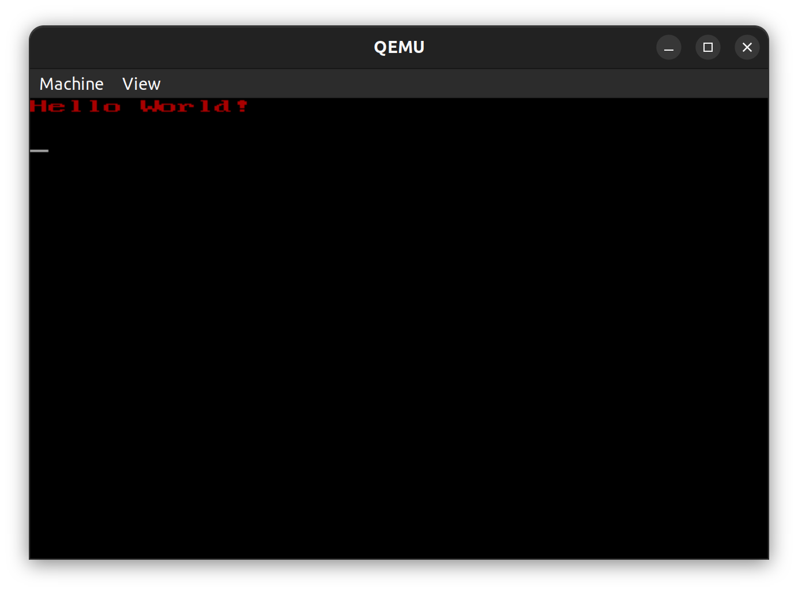

# A simple Operating System

## Develop and testing on Unix system

## Quick start

```console
make
```

## OS has
- Communicate hardwares throught IO ports ( IO utility )
- Simple VGA driver for 80x25 text mode
- VGA driver can ( put char on the screen, and print a string ) with colors



## References
- [nasm](https://www.nasm.us) is the assembler
- [qemu](https://www.qemu.org) is the hardware emulator